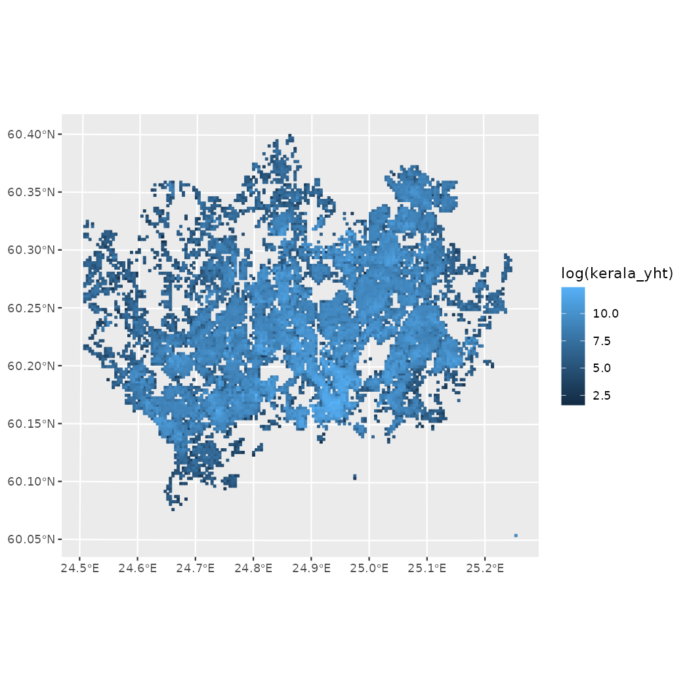
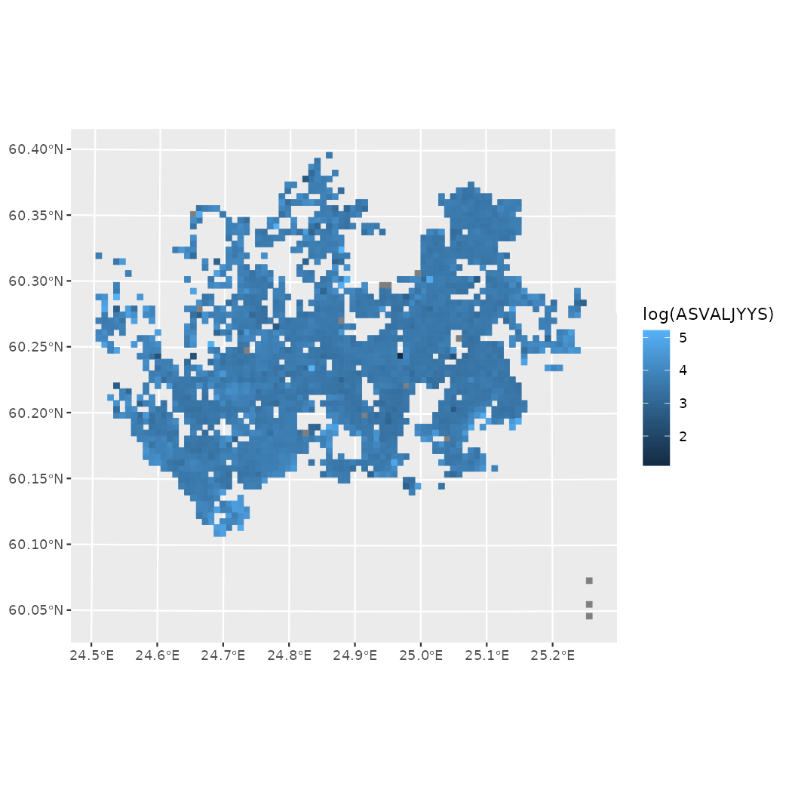

# Helsinki open data R tools

## helsinki - tutorial

helsinki R package provides tools to access open data from the Helsinki
region in Finland.

For contact information, source code and bug reports, see the project’s
[GitHub page](https://github.com/rOpenGov/helsinki). For other similar
packages and related blog posts, see the
[rOpenGov](https://ropengov.org) project website.

### Installation

Release version for most users:

``` r
install.packages("helsinki")
```

Development version for developers and other interested parties:

``` r
library(remotes)
remotes::install_github("ropengov/helsinki")
```

Load the package.

``` r
library(helsinki)
```

### API Access

The package has basic functions for interacting with WFS APIs, courtesy
of [FMI2-package](https://ropengov.github.io/fmi2/):
[`wfs_api()`](https://ropengov.github.io/helsinki/reference/wfs_api.md)
for returning “wfs_api” and
[`to_sf()`](https://ropengov.github.io/helsinki/reference/to_sf.md) for
turning these objects into sf-objects.

All available features of a given API can be easily listed with the
[`get_feature_list()`](https://ropengov.github.io/helsinki/reference/get_feature_list.md)
function. The API functions can, however, be used with a wide variety of
different `base.url` parameters.

``` r
input_url <- "https://kartta.hsy.fi/geoserver/wfs"

hsy_features <- get_feature_list(base.url = input_url)
# Select only features which are related to water utilities and services
hsy_vesihuolto <- hsy_features[which(hsy_features$Namespace == "vesihuolto"), ]
hsy_vesihuolto
#>                                                    Name
#> 185                        vesihuolto:VH_Vesipostit_HSY
#> 334                 vesihuolto:vesihuollon_toimipisteet
#> 336               vesihuolto:vh_hulevesiviemaroity_alue
#> 337             vesihuolto:vh_hva_laajeneminen_alustava
#> 338               vesihuolto:vh_hva_sekaviemarointialue
#> 339           vesihuolto:vh_hva_sva_eriyttamiskelpoiset
#> 340      vesihuolto:vh_muut_vesihuollon_toiminta_alueet
#> 341                         vesihuolto:vh_toiminta_alue
#> 342              vesihuolto:vh_toiminta_alue_talousvesi
#> 343 vesihuolto:vh_toiminta_alueen_alustava_laajeneminen
#>                                        Title  Namespace
#> 185                        VH_Vesipostit_HSY vesihuolto
#> 334                 vesihuollon_toimipisteet vesihuolto
#> 336               vh_hulevesiviemaroity_alue vesihuolto
#> 337             vh_hva_laajeneminen_alustava vesihuolto
#> 338               vh_hva_sekaviemarointialue vesihuolto
#> 339           vh_hva_sva_eriyttamiskelpoiset vesihuolto
#> 340      vh_muut_vesihuollon_toiminta_alueet vesihuolto
#> 341                         vh_toiminta_alue vesihuolto
#> 342              vh_toiminta_alue_talousvesi vesihuolto
#> 343 vh_toiminta_alueen_alustava_laajeneminen vesihuolto
# We select our feature of interest from this list: Location of waterposts
feature_of_interest <- "vesihuolto:VH_Vesipostit_HSY"
```

When the wanted feature and its Name (in other words: Namespace:Title
combination) is known, it can be downloaded with
[`get_feature()`](https://ropengov.github.io/helsinki/reference/get_feature.md)
by providing the correct `base.url` and the Name as the `typename`
parameter.

``` r
input_url <- "https://kartta.hsy.fi/geoserver/wfs"
feature_of_interest <- "vesihuolto:VH_Vesipostit_HSY"

# downloading a feature
waterposts <- get_feature(base.url = input_url, typename = feature_of_interest)

# Visualizing the location of waterposts
if (exists("waterposts")) {
  if (!is.null(waterposts)) {
    plot(waterposts$geom)
  }
}
```


Dots on a blank canvas do not make much sense and therefore
helsinki-package has
[`get_city_map()`](https://ropengov.github.io/helsinki/reference/get_city_map.md)
function for downloading city district boundaries. An example of this is
provided in the [Helsinki region district
maps](#helsinki-region-district-maps) section of this vignette.

Helsinki-package provides an easy-to-use menu-driven
[`select_feature()`](https://ropengov.github.io/helsinki/reference/select_feature.md)
function that effectively combines
[`get_feature_list()`](https://ropengov.github.io/helsinki/reference/get_feature_list.md)
and
[`get_feature()`](https://ropengov.github.io/helsinki/reference/get_feature.md).
At default it only returns the Name of the wanted function, but if `get`
parameter is set to TRUE, it returns an sf_object which can be easily
visualized.

``` r
input_url <- "https://kartta.hsy.fi/geoserver/wfs"

# Interactive example with select_feature
selected_feature <- select_feature(base.url = input_url)
feature <- get_feature(base.url = input_url, typename = selected_feature)

# Skipping a redundant step with parameter get = TRUE
feature <- select_feature(base.url = input_url, get = TRUE)
```

#### Helsinki Region Environmental Services HSY open data

The above example shows a general use case which can easily be applied
to Helsinki Region Environmental Services (HSY) WFS API as well as other
service providers’ APIs.

For legacy reasons, helsinki-package has also some specialized functions
that aim to make downloading often used data as easy as possible.

Specifically, there are two new functions that replace deprecated
functionalities from `get_hsy()` function:
[`get_vaestotietoruudukko()`](https://ropengov.github.io/helsinki/reference/get_vaestotietoruudukko.md)
(population grid) and
[`get_rakennustietoruudukko()`](https://ropengov.github.io/helsinki/reference/get_rakennustietoruudukko.md)
(building information grid).

``` r
library(ggplot2)

pop_grid <- get_vaestotietoruudukko(year = 2018)
building_grid <- get_rakennustietoruudukko(year = 2020)

# Logarithmic scales to make the visualizations more discernible
if (!all(is.null(pop_grid), is.null(building_grid))) {
  ggplot(pop_grid) +
    geom_sf(aes(colour = log(asukkaita), fill = log(asukkaita)))
  ggplot(building_grid) +
    geom_sf(aes(colour = log(kerala_yht), fill = log(kerala_yht)))
}
```



With the previous version of the helsinki package, years 2015 to 2020
were supported. In 2022 a new year was added, 2011, demonstrating how
the API may be updated more regularly than the package. The
[`get_feature_list()`](https://ropengov.github.io/helsinki/reference/get_feature_list.md)
function can be used to download datasets that are not baked into
included functions.

In addition to the datasets listed in the API getting updated, there are
also legacy datasets that were never included in the API. We have added
the functionality to download datasets from a wider selection of years,
as zip files from a different file repository. These files may differ
slightly from those downloaded via API and have different column names
and larger grid squares and so on.

``` r
library(ggplot2)

pop_grid2 <- get_vaestotietoruudukko(year = 2011)
building_grid2 <- get_rakennustietoruudukko(year = 2011)

if (!all(is.null(pop_grid2), is.null(building_grid2))) {
  ggplot(pop_grid2) +
    geom_sf(aes(colour = log(ASUKKAITA), fill = log(ASUKKAITA)))
  ggplot(building_grid2) +
    geom_sf(aes(colour = log(ASVALJYYS), fill = log(ASVALJYYS)))
}
```



While easy enough to build, specialized functions such as these are
probably not something that power users want to rely on in their work
flows. They also add more manual phases to package maintenance and
therefore are probably not the direction we’re heading in the future. If
you feel differently about this and there is a dataset that gets a lot
of use, feel free to drop us a suggestion in
[GitHub](https://github.com/rOpenGov/helsinki/issues).

### Service and event information

Function
[`get_servicemap()`](https://ropengov.github.io/helsinki/reference/get_servicemap.md)
retrieves regional service data from city of Helsinki [Service Map
API](http://api.hel.fi/servicemap/v2/), that contains data from the
[Service Map](https://palvelukartta.hel.fi/fi/).

``` r
# Search for "puisto" (park) (specify q="query")
search_puisto <- get_servicemap(query = "search", q = "puisto")
# Study results: 47 variables in the data frame
str(search_puisto, max.level = 1)
#> List of 4
#>  $ count   : int 4781
#>  $ next    : chr "http://api.hel.fi/servicemap/v2/search/?page=2&q=puisto"
#>  $ previous: NULL
#>  $ results :'data.frame':    20 obs. of  33 variables:
```

We can see that this search returns a large number of results, over
2000. The results are returned as pages, where each page has 20 results
by default. By giving no additional search parameters, we get 20 results
from the first page of search results.

``` r
# Get names for the first 20 results
search_puisto$results$name.fi
#>  [1] "Puistopolun peruskoulu"              
#>  [2] "Kankarepuiston peruskoulu"           
#>  [3] "Puistolan peruskoulu"                
#>  [4] "Pihkapuiston ala-asteen koulu"       
#>  [5] "Kaupunkiympäristön asiakaspalvelu"   
#>  [6] "Puistolanraitin ala-asteen koulu"    
#>  [7] "Puistolan kirjasto"                  
#>  [8] "Juvanpuiston nuorisotila"            
#>  [9] "Kilonpuiston koulu"                  
#> [10] "Kytöpuiston koulu"                   
#> [11] "Pirkkolan liikuntapuisto / Uimahalli"
#> [12] "Juvanpuiston koulu"                  
#> [13] "Jalavapuiston koulu"                 
#> [14] "Tapiolan asukaspuisto"               
#> [15] "Mankkaan asukaspuisto"               
#> [16] "Karakallion asukaspuisto"            
#> [17] "Leppävaaran asukaspuisto"            
#> [18] "Perkkaan asukaspuisto"               
#> [19] "Kivenlahden asukaspuisto"            
#> [20] "Pisan asukaspuisto"

# See what kind of data is given for services
names(search_puisto$results)
#>  [1] "id"                                               
#>  [2] "object_type"                                      
#>  [3] "municipality"                                     
#>  [4] "name.fi"                                          
#>  [5] "name.sv"                                          
#>  [6] "name.en"                                          
#>  [7] "street_address.fi"                                
#>  [8] "street_address.sv"                                
#>  [9] "street_address.en"                                
#> [10] "accessibility_shortcoming_count.rollator"         
#> [11] "accessibility_shortcoming_count.wheelchair"       
#> [12] "accessibility_shortcoming_count.hearing_aid"      
#> [13] "accessibility_shortcoming_count.reduced_mobility" 
#> [14] "accessibility_shortcoming_count.visually_impaired"
#> [15] "accessibility_shortcoming_count.stroller"         
#> [16] "contract_type.id"                                 
#> [17] "contract_type.description.fi"                     
#> [18] "contract_type.description.sv"                     
#> [19] "contract_type.description.en"                     
#> [20] "department.id"                                    
#> [21] "department.municipality"                          
#> [22] "department.name.fi"                               
#> [23] "department.name.en"                               
#> [24] "department.name.sv"                               
#> [25] "department.street_address.fi"                     
#> [26] "department.street_address.sv"                     
#> [27] "department.street_address.en"                     
#> [28] "root_department.id"                               
#> [29] "root_department.name.fi"                          
#> [30] "root_department.name.sv"                          
#> [31] "root_department.name.en"                          
#> [32] "location.type"                                    
#> [33] "location.coordinates"
```

More results could be retrieved and viewed by giving additional `search`
parameters.

``` r
search_puisto <- get_servicemap(query = "search", q = "puisto", page_size = 30, page = 2)

str(search_puisto)
#> List of 4
#>  $ count   : int 4781
#>  $ next    : chr "http://api.hel.fi/servicemap/v2/search/?page=3&page_size=30&q=puisto"
#>  $ previous: chr "http://api.hel.fi/servicemap/v2/search/?page_size=30&q=puisto"
#>  $ results :'data.frame':    30 obs. of  31 variables:
#>   ..$ id                                               : int [1:30] 1946 18972 19804 20267 20327 20351 20355 20378 20379 62675 ...
#>   ..$ object_type                                      : chr [1:30] "unit" "unit" "unit" "unit" ...
#>   ..$ municipality                                     : chr [1:30] "helsinki" "vantaa" "vantaa" "espoo" ...
#>   ..$ name.fi                                          : chr [1:30] "Puistolan palvelutalo" "Näätäpuiston päiväkoti" "Ilvespuiston päiväkoti" "Matinkylän asukaspuisto" ...
#>   ..$ name.sv                                          : chr [1:30] "Parkstads servicehus" "Näätäpuiston päiväkoti" "Ilvespuiston päiväkoti" "Mattby invånarpark" ...
#>   ..$ name.en                                          : chr [1:30] "Puistola assisted living facility" "Näätäpuiston päiväkoti" "Ilvespuiston päiväkoti" "Matinkylä residents' park" ...
#>   ..$ street_address.fi                                : chr [1:30] "Aksiisipolku 1 B" "Siilireitti 12" "Ilvestie 2" "Matinraitti 12" ...
#>   ..$ street_address.sv                                : chr [1:30] "Accisstigen 1 B" "Igelkottsrutten 12" "Lovägen 2" "Mattstråket 12" ...
#>   ..$ street_address.en                                : chr [1:30] "Aksiisipolku 1 B" "Siilireitti 12" "Ilvestie 2" "Matinraitti 12" ...
#>   ..$ accessibility_shortcoming_count.rollator         : int [1:30] 3 7 2 3 6 5 6 3 4 NA ...
#>   ..$ accessibility_shortcoming_count.wheelchair       : int [1:30] 3 7 2 7 6 5 7 3 10 NA ...
#>   ..$ accessibility_shortcoming_count.hearing_aid      : int [1:30] 1 1 1 1 1 1 1 1 1 NA ...
#>   ..$ accessibility_shortcoming_count.reduced_mobility : int [1:30] 1 4 1 4 4 3 3 3 2 NA ...
#>   ..$ accessibility_shortcoming_count.visually_impaired: int [1:30] 6 5 2 7 5 6 7 3 19 NA ...
#>   ..$ accessibility_shortcoming_count.stroller         : int [1:30] NA 1 NA NA 2 NA NA 1 NA NA ...
#>   ..$ contract_type.id                                 : chr [1:30] "MUNICIPAL_SERVICE" "MUNICIPAL_SERVICE" "MUNICIPAL_SERVICE" "MUNICIPAL_SERVICE" ...
#>   ..$ contract_type.description.fi                     : chr [1:30] "kunnallinen palvelu, Sosiaali-, terveys- ja pelastustoimiala, Helsingin kaupunki" "kunnallinen palvelu, Kasvatuksen ja oppimisen toimiala, Vantaa" "kunnallinen palvelu, Kasvatuksen ja oppimisen toimiala, Vantaa" "kunnallinen palvelu, Kasvun ja oppimisen toimiala, Espoo" ...
#>   ..$ contract_type.description.sv                     : chr [1:30] "kommunal tjänst, Social-, hälsovårds- och räddningssektorn, Helsingfors stad" "kommunal tjänst, Verksamhetsområdet för fostran och lärande, Vanda" "kommunal tjänst, Verksamhetsområdet för fostran och lärande, Vanda" "kommunal tjänst, Sektorn för fostran och lärande, Esbo" ...
#>   ..$ contract_type.description.en                     : chr [1:30] "municipal service, The Social Services, Health Care and Rescue Services Division, City of Helsinki" "municipal service, Education and Learning Department, Vantaa" "municipal service, Education and Learning Department, Vantaa" "municipal service, Growth and Learning Sector, Espoo" ...
#>   ..$ department.id                                    : chr [1:30] "fff7cfd5-9161-4dad-aa0c-0706a8a63b26" "ab4f37d0-3e53-462e-ad40-c73b57e3e39e" "ab4f37d0-3e53-462e-ad40-c73b57e3e39e" "d8dab34f-a68f-4244-b906-84e7f651b8e1" ...
#>   ..$ department.street_address                        : logi [1:30] NA NA NA NA NA NA ...
#>   ..$ department.municipality                          : chr [1:30] "helsinki" "vantaa" "vantaa" "espoo" ...
#>   ..$ department.name.fi                               : chr [1:30] "Sosiaali-, terveys- ja pelastustoimiala" "Varhaiskasvatus" "Varhaiskasvatus" "Kasvun ja oppimisen toimiala, Espoo" ...
#>   ..$ department.name.sv                               : chr [1:30] "Social-, hälsovårds- och räddningssektorn" "Småbarnspedagogik" "Småbarnspedagogik" "Sektorn för fostran och lärande, Esbo" ...
#>   ..$ department.name.en                               : chr [1:30] "The Social Services, Health Care and Rescue Services Division" "Early Childhood Education" "Early Childhood Education" "Growth and Learning Sector, Espoo" ...
#>   ..$ root_department.id                               : chr [1:30] "83e74666-0836-4c1d-948a-4b34a8b90301" "6d78f89c-9fd7-41d9-84e0-4b78c0fa25ce" "6d78f89c-9fd7-41d9-84e0-4b78c0fa25ce" "520a4492-cb78-498b-9c82-86504de88dce" ...
#>   ..$ root_department.name.fi                          : chr [1:30] "Helsingin kaupunki" "Vantaan kaupunki" "Vantaan kaupunki" "Espoon kaupunki" ...
#>   ..$ root_department.name.sv                          : chr [1:30] "Helsingfors stad" "Vanda stad" "Vanda stad" "Esbo stad" ...
#>   ..$ root_department.name.en                          : chr [1:30] "City of Helsinki" "City of Vantaa" "City of Vantaa" "City of Espoo" ...
#>   ..$ location.type                                    : chr [1:30] "Point" "Point" "Point" "Point" ...
#>   ..$ location.coordinates                             :List of 30
#>   .. ..$ : num [1:2] 25 60.3
#>   .. ..$ : num [1:2] 25.1 60.3
#>   .. ..$ : num [1:2] 25.1 60.4
#>   .. ..$ : num [1:2] 24.7 60.2
#>   .. ..$ : num [1:2] 24.7 60.2
#>   .. ..$ : num [1:2] 24.7 60.2
#>   .. ..$ : num [1:2] 24.7 60.1
#>   .. ..$ : num [1:2] 24.6 60.2
#>   .. ..$ : num [1:2] 24.7 60.2
#>   .. ..$ : num [1:2] 25 60.3
#>   .. ..$ : num [1:2] 25.1 60.3
#>   .. ..$ : num [1:2] 25.1 60.3
#>   .. ..$ : num [1:2] 24.7 60.3
#>   .. ..$ : num [1:2] 24.7 60.2
#>   .. ..$ : num [1:2] 25.1 60.2
#>   .. ..$ : num [1:2] 25 60.2
#>   .. ..$ : num [1:2] 25 60.2
#>   .. ..$ : num [1:2] 25 60.2
#>   .. ..$ : num [1:2] 25 60.2
#>   .. ..$ : num [1:2] 25 60.2
#>   .. ..$ : num [1:2] 24.9 60.2
#>   .. ..$ : num [1:2] 25 60.2
#>   .. ..$ : num [1:2] 25.1 60.2
#>   .. ..$ : num [1:2] 24.9 60.2
#>   .. ..$ : num [1:2] 24.9 60.3
#>   .. ..$ : num [1:2] 25.1 60.3
#>   .. ..$ : num [1:2] 24.9 60.2
#>   .. ..$ : num [1:2] 25 60.3
#>   .. ..$ : num [1:2] 25.1 60.2
#>   .. ..$ : num [1:2] 25.1 60.2
search_puisto$results$name.fi
#>  [1] "Puistolan palvelutalo"                                                                                                                                     
#>  [2] "Näätäpuiston päiväkoti"                                                                                                                                    
#>  [3] "Ilvespuiston päiväkoti"                                                                                                                                    
#>  [4] "Matinkylän asukaspuisto"                                                                                                                                   
#>  [5] "Viherkallion asukaspuisto"                                                                                                                                 
#>  [6] "Latokasken asukaspuisto"                                                                                                                                   
#>  [7] "Soukan asukaspuisto"                                                                                                                                       
#>  [8] "Kylätalo Palttinan asukaspuisto"                                                                                                                           
#>  [9] "Suvelan asukaspuisto"                                                                                                                                      
#> [10] "Iltapäivätoiminta / Puistolan peruskoulu / POY, Kasvatuksen ja koulutuksen toimiala (pidennetty oppivelvollisuus)"                                         
#> [11] "Iltapäivätoiminta / Puistolanraitin ala-aste / Toiminta-alueittain järjestettävä opetus, Kasvatuksen ja koulutuksen toimiala (vaativan tuen erityisopetus)"
#> [12] "Kierrätyskeskus Porttipuisto"                                                                                                                              
#> [13] "Hiirisuon asukaspuisto"                                                                                                                                    
#> [14] "Järvenperän asukaspuisto"                                                                                                                                  
#> [15] "Iltapäivätoiminta / Puistopolun peruskoulu / Vaativan tuen erityisopetus, Kasvatuksen ja koulutuksen toimiala (vaativan tuen erityisopetus)"               
#> [16] "Iltapäivätoiminta / Leikkipuisto Arabia"                                                                                                                   
#> [17] "Iltapäivätoiminta / Leikkipuisto Brahe"                                                                                                                    
#> [18] "Iltapäivätoiminta / Leikkipuisto Etupelto"                                                                                                                 
#> [19] "Iltapäivätoiminta / Leikkipuisto Filpus"                                                                                                                   
#> [20] "Iltapäivätoiminta / Leikkipuisto Hilleri"                                                                                                                  
#> [21] "Iltapäivätoiminta / Leikkipuisto Ida"                                                                                                                      
#> [22] "Iltapäivätoiminta / Leikkipuisto Intia"                                                                                                                    
#> [23] "Iltapäivätoiminta / Leikkipuisto Iso-Antti"                                                                                                                
#> [24] "Iltapäivätoiminta / Leikkipuisto Isoneva"                                                                                                                  
#> [25] "Iltapäivätoiminta / Leikkipuisto Torpparinmäki"                                                                                                            
#> [26] "Iltapäivätoiminta / Leikkipuisto Kankarepuisto"                                                                                                            
#> [27] "Iltapäivätoiminta / Leikkipuisto Kannelmäki"                                                                                                               
#> [28] "Iltapäivätoiminta / Leikkipuisto Kesanto"                                                                                                                  
#> [29] "Iltapäivätoiminta / Leikkipuisto Kiiltotähti"                                                                                                              
#> [30] "Iltapäivätoiminta / Leikkipuisto Kipinäpuisto"
```

As we could see from above example, the returned data frame had 30
observations with 29 variables. At full width this output can be messy
to handle in R console. One possible option would be to turn it into a
more easily manageable tibble (which often is not a bad idea), another
is to limit the extent of the query at the start.

Function
[`get_linkedevents()`](https://ropengov.github.io/helsinki/reference/get_linkedevents.md)
retrieves regional event data from the new [Linked Events
API](http://api.hel.fi/linkedevents/v1/).

``` r
# Search for current events
events <- get_linkedevents(query = "event")
# Get names for the first 20 results
events$data$name$fi
#>  [1] "Lukukoira Noppa"             "Lukukoira Noppa"            
#>  [3] "Lukukoira Noppa"             "Lukukoira Noppa"            
#>  [5] "Lukukoira Noppa"             "Englanninkielinen lukupiiri"
#>  [7] "Englanninkielinen lukupiiri" "Englanninkielinen lukupiiri"
#>  [9] "Englanninkielinen lukupiiri" "Englanninkielinen lukupiiri"
#> [11] "Piano day Helsinki 2026"     "KauhuCon 2026"              
#> [13] "Lasten lauantaileffa"        "Lasten lauantaileffa"       
#> [15] "Lasten lauantaileffa"        "Lasten lauantaileffa"       
#> [17] "Lasten lauantaileffa"        "Lasten lauantaileffa"       
#> [19] "Lasten lauantaileffa"        "Lasten lauantaileffa"
# See what kind of data is given for events
names(events$data)
#>  [1] "id"                          "has_user_editable_resources"
#>  [3] "location"                    "keywords"                   
#>  [5] "registration"                "super_event"                
#>  [7] "event_status"                "type_id"                    
#>  [9] "external_links"              "offers"                     
#> [11] "data_source"                 "publisher"                  
#> [13] "sub_events"                  "images"                     
#> [15] "videos"                      "in_language"                
#> [17] "audience"                    "created_time"               
#> [19] "last_modified_time"          "date_published"             
#> [21] "start_time"                  "end_time"                   
#> [23] "custom_data"                 "environmental_certificate"  
#> [25] "environment"                 "audience_min_age"           
#> [27] "audience_max_age"            "super_event_type"           
#> [29] "deleted"                     "maximum_attendee_capacity"  
#> [31] "minimum_attendee_capacity"   "enrolment_start_time"       
#> [33] "enrolment_end_time"          "local"                      
#> [35] "replaced_by"                 "short_description"          
#> [37] "name"                        "description"                
#> [39] "provider"                    "provider_contact_info"      
#> [41] "info_url"                    "location_extra_info"        
#> [43] "@id"                         "@context"                   
#> [45] "@type"
```

### Helsinki region district maps

Helsinki region geographic data can be accessed from a WFS API by using
the get_city_map() function. Data is available for all 4 cities in the
capital region: Helsinki, Espoo, Vantaa and Kauniainen.

Administrative divisions can be accessed on 3 distinct levels:
“suuralue”, “tilastoalue” and “pienalue”. Literal, completely unofficial
translations for these could be “grand district”, “statistical area” and
“(minor) district”. The naming convention of these levels is sometimes
confusing even in Finnish documents and different names can vary by city
and time.

The main takeaway is that “suuralue” is the highest-level division and
“pienalue” is the most granular level of division. “Tilastoalue” is
somewhere between these two. These are the names to be used even if the
city of interest might not use them in their Finnish or English website.

As promised earlier in [API Access](#api-access), the following example
gives an idea on how to visualize waterpost locations (and, of course,
other types of spatial data as well) on capital region map.

``` r
helsinki <- get_city_map(city = "helsinki", level = "suuralue")
espoo <- get_city_map(city = "espoo", level = "suuralue")
vantaa <- get_city_map(city = "vantaa", level = "suuralue")
kauniainen <- get_city_map(city = "kauniainen", level = "suuralue")

library(ggplot2)

if (!all(is.null(helsinki), is.null(espoo), is.null(vantaa), is.null(kauniainen), is.null(waterposts))) {
  ggplot() +
    geom_sf(data = helsinki) +
    geom_sf(data = espoo) +
    geom_sf(data = vantaa) +
    geom_sf(data = kauniainen) +
    geom_sf(data = waterposts)
}
```

In addition, it is possible to download “aanestysalue” (voting district)
divisions for the city of Helsinki. Currently this data is not available
for other cities and it must be accessed from other sources.

``` r
map <- get_city_map(city = "helsinki", level = "suuralue")
voting_district <- get_city_map(city = "helsinki", level = "aanestysalue")
```

``` r
library(sf)
plot(sf::st_geometry(map))
plot(sf::st_geometry(voting_district))
```

For other cities than Helsinki voting districts are currently not
available.

### Helsinki Region Infoshare statistics API

Function
[`get_hri_stats()`](https://ropengov.github.io/helsinki/reference/get_hri_stats.md)
retrieves data from the [Helsinki Region Infoshare statistics
API](http://dev.hel.fi/stats/). Specify a dataset to retrieve. In this
specific example we will download the first item on the stats_list
object. The output is a three-dimensional array.

``` r
# Retrieve list of available data
stats_list <- get_hri_stats(query = "")
# Show first results
head(stats_list)
#> NULL

if (!is.null(stats_list)) {
  # Retrieve a specific dataset
  stats_res <- get_hri_stats(query = stats_list[1])
  # Show the structure of the results
  str(stats_res)
}
```

### Licensing and Citations

#### Citing the data

See [`help()`](https://rdrr.io/r/utils/help.html) to get citation
information for each function and related data sources.

If no such information is explicitly stated, see data provider’s website
for more information.

#### Citing the R package

``` r
citation("helsinki")
Kindly cite the helsinki R package as follows:

  Juuso Parkkinen, Joona Lehtomaki, Pyry Kantanen, and Leo Lahti
  (2022). helsinki R package. R package version 1.0.6 URL:
  https://github.com/rOpenGov/helsinki

A BibTeX entry for LaTeX users is

  @Misc{,
    title = {helsinki R package},
    author = {Juuso Parkkinen and Joona Lehtomaki and Pyry Kantanen and Leo Lahti},
    url = {https://github.com/rOpenGov/helsinki},
    year = {2022},
    note = {R package version 1.0.6},
  }

Many thanks for all contributors! For more info, see:
https://github.com/rOpenGov/helsinki
```

#### Session info

This vignette was created with

``` r
sessionInfo()
#> R version 4.5.2 (2025-10-31)
#> Platform: x86_64-pc-linux-gnu
#> Running under: Ubuntu 24.04.3 LTS
#> 
#> Matrix products: default
#> BLAS:   /usr/lib/x86_64-linux-gnu/openblas-pthread/libblas.so.3 
#> LAPACK: /usr/lib/x86_64-linux-gnu/openblas-pthread/libopenblasp-r0.3.26.so;  LAPACK version 3.12.0
#> 
#> locale:
#>  [1] LC_CTYPE=C.UTF-8       LC_NUMERIC=C           LC_TIME=C.UTF-8       
#>  [4] LC_COLLATE=C.UTF-8     LC_MONETARY=C.UTF-8    LC_MESSAGES=C.UTF-8   
#>  [7] LC_PAPER=C.UTF-8       LC_NAME=C              LC_ADDRESS=C          
#> [10] LC_TELEPHONE=C         LC_MEASUREMENT=C.UTF-8 LC_IDENTIFICATION=C   
#> 
#> time zone: UTC
#> tzcode source: system (glibc)
#> 
#> attached base packages:
#> [1] stats     graphics  grDevices utils     datasets  methods   base     
#> 
#> other attached packages:
#> [1] ggplot2_4.0.2  helsinki_1.0.6
#> 
#> loaded via a namespace (and not attached):
#>  [1] sass_0.4.10        generics_0.1.4     class_7.3-23       xml2_1.5.2        
#>  [5] KernSmooth_2.23-26 digest_0.6.39      magrittr_2.0.4     evaluate_1.0.5    
#>  [9] grid_4.5.2         RColorBrewer_1.1-3 fastmap_1.2.0      jsonlite_2.0.0    
#> [13] e1071_1.7-17       DBI_1.3.0          httr_1.4.8         purrr_1.2.1       
#> [17] scales_1.4.0       textshaping_1.0.5  jquerylib_0.1.4    cli_3.6.5         
#> [21] rlang_1.1.7        units_1.0-0        withr_3.0.2        cachem_1.1.0      
#> [25] yaml_2.3.12        tools_4.5.2        dplyr_1.2.0        curl_7.0.0        
#> [29] vctrs_0.7.1        R6_2.6.1           proxy_0.4-29       lifecycle_1.0.5   
#> [33] classInt_0.4-11    fs_1.6.7           htmlwidgets_1.6.4  ragg_1.5.1        
#> [37] pkgconfig_2.0.3    desc_1.4.3         pkgdown_2.2.0      pillar_1.11.1     
#> [41] bslib_0.10.0       gtable_0.3.6       glue_1.8.0         Rcpp_1.1.1        
#> [45] sf_1.1-0           systemfonts_1.3.2  xfun_0.56          tibble_3.3.1      
#> [49] tidyselect_1.2.1   knitr_1.51         farver_2.1.2       htmltools_0.5.9   
#> [53] labeling_0.4.3     rmarkdown_2.30     compiler_4.5.2     S7_0.2.1
```
