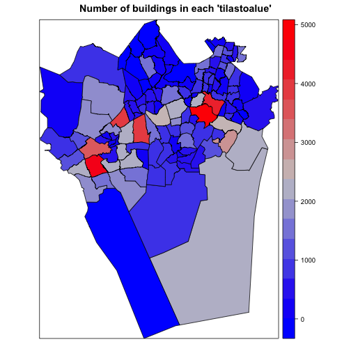

<!--
%\VignetteEngine{knitr}
%\VignetteIndexEntry{An R Markdown Vignette made with knitr}
-->


helsinki - tutorial
===========

This R package provides tools to access open data from the Helsinki region in Finland
as part of the [rOpenGov](http://ropengov.github.io) project.

For contact information and source code, see the [github page](https://github.com/rOpenGov/helsinki). 

## Available data sources

The following data sources are currently available:
* [Helsinki region district maps](#aluejakokartat) (Helsingin seudun aluejakokartat)
 * Aluejakokartat: kunta, pien-, suur-, tilastoalueet (Helsinki region district maps)
 * Äänestysaluejako: (Helsinki region election district maps)
 * Source: [Helsingin kaupungin Kiinteistövirasto (HKK)](http://ptp.hel.fi/avoindata/)
* Helsinki Real Estate Department (HKK:n avointa dataa)
 * Spatial data from [Helsingin kaupungin Kiinteistövirasto (HKK)](http://ptp.hel.fi/avoindata/) availabe in the [gisfin](https://github.com/rOpenGov/gisfin) package, see [gisfin tutorial](https://github.com/rOpenGov/gisfin/blob/master/vignettes/gisfin_tutorial.md) for examples
* [Helsinki region environmental services](#hsy) (HSY:n avointa dataa)
 * Väestötietoruudukko (population grid)
 * Rakennustietoruudukko (building information grid)
 * SeutuRAMAVA (building land resource information(?))
 * Source: [Helsingin seudun ympäristöpalvelut, HSY](http://www.hsy.fi/seututieto/kaupunki/paikkatiedot/Sivut/Avoindata.aspx)
* [Service and event information](#servicemap)
 * [Helsinki region Service Map](http://www.hel.fi/palvelukartta/Default.aspx?language=fi&city=91) (Pääkaupunkiseudun Palvelukartta)
 * [Omakaupunki](http://api.omakaupunki.fi/) (requires personal API key, no examples given)
* [Helsinki Region Infoshare statistics API](#hri_stats)
 * Aluesarjat (regional time series data)
 * More data coming...
 * Source: [Helsinki Region Infoshare statistics API](http://dev.hel.fi/stats/)

List of potential data sources to be added to the package can be found [here](https://github.com/rOpenGov/helsinki/blob/master/vignettes/todo-datasets.md).

## Installation

Release version for general users:


```r
install.packages("helsinki")
```


Development version for developers:


```r
install.packages("devtools")
library(devtools)
install_github("helsinki", "ropengov")
```


Load package.


```r
library(helsinki)
```


## <a name="aluejakokartat"></a>Helsinki region district maps

Helsinki region district maps (Helsingin seudun aluejakokartat) from [Helsingin kaupungin Kiinteistövirasto (HKK)](http://ptp.hel.fi/avoindata/) are available in the helsinki package with `data(aluejakokartat)`. These are preprocessed in the [gisfin](https://github.com/rOpenGov/gisfin) package, and more examples can be found in the [gisfin tutorial](https://github.com/rOpenGov/gisfin/blob/master/vignettes/gisfin_tutorial.md). 


```r
data(aluejakokartat)
```


## <a name="hsy"></a> Helsinki region environmental services

Retrieve data from [Helsingin seudun ympäristöpalvelut (HSY)](http://www.hsy.fi/seututieto/kaupunki/paikkatiedot/Sivut/Avoindata.aspx) with `get_hsy()`.

### Population grid 

Population grid (väestötietoruudukko) with 250m x 250m grid size in year 2013 contains the number of people in different age groups. The most rarely populated grids are left out (0-4 persons), and grids wiht less than 99 persons are censored with '99' to guarantee privacy.


```r
sp.vaesto <- get_hsy(which.data = "Vaestotietoruudukko", which.year = 2013)
head(sp.vaesto@data)
```


### Helsinki building information

Building information grid (rakennustietoruudukko) in Helsinki region on grid-level (500m x 500m): building counts (lukumäärä), built area (kerrosala), usage (käyttötarkoitus), and region
efficiency (aluetehokkuus).


```r
sp.rakennus <- get_hsy(which.data = "Rakennustietoruudukko", which.year = 2013)
head(sp.rakennus@data)
```


### Helsinki building area capacity

Building area capacity per municipal region (kaupunginosittain summattua tietoa rakennusmaavarannosta). Plot with number of buildlings with `spplot()`.


```r
sp.ramava <- get_hsy(which.data = "SeutuRAMAVA_tila", which.year = 2013)
head(sp.ramava@data)
# Values with less than five units are given as 999999999, set those to zero
sp.ramava@data[sp.ramava@data == 999999999] <- 0
# Plot number of buildings for each region
spplot(sp.ramava, zcol = "RAKLKM", main = "Number of buildings in each 'tilastoalue'")
```

 


## <a name="servicemap"></a>Service and event information

Function `get_servicemap()` retrieves regional service data from the [Service Map](http://www.hel.fi/palvelukartta/Default.aspx?language=fi&city=91) [API](http://www.hel.fi/palvelukarttaws/rest/ver2_en.html).


```r
# Get servicetree
pk.servicetree <- get_servicemap("servicetree")
# Get id for parks
str(pk.servicetree[[1]]$children[[7]]$children[[2]])
# Get parks data
parks.data <- get_servicemap("unit", service = 25664)
# Check what data is given for the first park
str(parks.data[[1]])
```


Function `get_omakaupunki()` retrieves regional service and event data from the [Omakaupunki API](http://api.omakaupunki.fi/). However, the API needs a personal key, so no examples are given here.

## <a name="hri_stats"></a> Helsinki Region Infoshare statistics API

Functoin `get_hri_stats()` retrieves data from the [Helsinki Region Infoshare statistics API](http://dev.hel.fi/stats/). Note! The implementation will be updated!


```r
# Retrieve list of available data
stats.list <- get_hri_stats(query = "")
# Show first results
head(stats.list)
```

```
##                             Helsingin väestö äidinkielen mukaan 1.1. 
##                            "aluesarjat_a03s_hki_vakiluku_aidinkieli" 
##                                           Syntyneet äidin iän mukaan 
##                             "aluesarjat_hginseutu_va_vm04_syntyneet" 
##   Vantaalla asuva työllinen työvoima sukupuolen ja iän mukaan 31.12. 
##                             "aluesarjat_c01s_van_tyovoima_sukupuoli" 
## Espoon lapsiperheet lasten määrän mukaan (0-17-vuotiaat lapset) 1.1. 
##                            "aluesarjat_b03s_esp_lapsiperheet_alle18" 
##                                 Väestö iän ja sukupuolen mukaan 1.1. 
##                          "aluesarjat_hginseutu_va_vr01_vakiluku_ika" 
##         Helsingin asuntotuotanto rahoitusmuodon ja huoneluvun mukaan 
##                         "aluesarjat_a03hki_astuot_rahoitus_huonelkm"
```


Specify a dataset to retrieve. The output is currently a three-dimensional array.


```r
# Retrieve a specific dataset
stats.res <- get_hri_stats(query = stats.list[1])
# Show the structure of the results
str(stats.res)
```

```
##  num [1:22, 1:4, 1:197] 497526 501518 508659 515765 525031 ...
##  - attr(*, "dimnames")=List of 3
##   ..$ vuosi     : chr [1:22] "1992" "1993" "1994" "1995" ...
##   ..$ aidinkieli: chr [1:4] "Kaikki äidinkielet" "Suomi ja saame" "Ruotsi" "Muu kieli"
##   ..$ alue      : chr [1:197] "091 Helsinki" "091 1 Eteläinen suurpiiri" "091 101 Vironniemen peruspiiri" "091 10 Kruununhaka" ...
```


More examples to be added.

### Citation

**Citing the data:** See `help()` to get citation information for each data source individually.

**Citing the R package:**


```r
citation("helsinki")
```

```

Kindly cite the helsinki R package as follows:

  (C) Juuso Parkkinen, Leo Lahti and Joona Lehtomaki 2014.
  helsinki R package

A BibTeX entry for LaTeX users is

  @Misc{,
    title = {helsinki R package},
    author = {Juuso Parkkinen and Leo Lahti and Joona Lehtomaki},
    year = {2014},
  }

Many thanks for all contributors! For more info, see:
https://github.com/rOpenGov/helsinki
```


### Session info


This vignette was created with


```r
sessionInfo()
```

```
## R version 3.0.3 (2014-03-06)
## Platform: x86_64-apple-darwin10.8.0 (64-bit)
## 
## locale:
## [1] en_US.UTF-8/en_US.UTF-8/en_US.UTF-8/C/en_US.UTF-8/en_US.UTF-8
## 
## attached base packages:
## [1] stats     graphics  grDevices utils     datasets  methods   base     
## 
## other attached packages:
## [1] knitr_1.5       reshape2_1.2.2  helsinki_0.9.15 RCurl_1.95-4.1 
## [5] bitops_1.0-6    rjson_0.2.13    maptools_0.8-29 sp_1.0-14      
## [9] roxygen2_3.1.0 
## 
## loaded via a namespace (and not attached):
##  [1] brew_1.0-6      codetools_0.2-8 digest_0.6.4    evaluate_0.5.1 
##  [5] foreign_0.8-60  formatR_0.10    grid_3.0.3      lattice_0.20-27
##  [9] markdown_0.6.4  plyr_1.8.1      Rcpp_0.11.1     stringr_0.6.2  
## [13] tools_3.0.3
```


