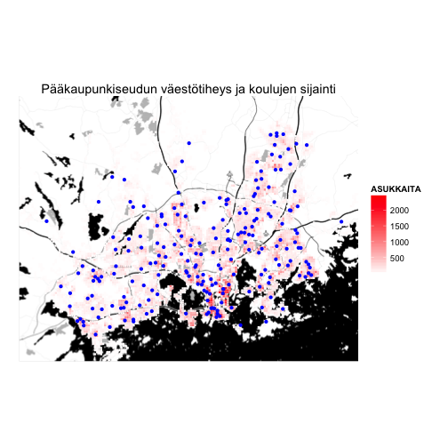

# helsinki - Pääkaupunkiseudun avoimen datan työkalupakki R-kielelle

## Miten pääkaupunkiseudun asukastiheys suhtautuu palveluiden määrään?

Jotain introlätinää alkuun.

Haetaan ensin väestöruudukko ([HSY:ltä](http://www.hsy.fi/seututieto/kaupunki/paikkatiedot/Sivut/Avoindata.aspx)) funktiolla `get_hsy()`.


```r
popgrid.sp <- get_hsy(which.data = "Vaestotietoruudukko", which.year = 2013)
# Transform into lat/long coordinates
library(sp)
library(rgdal)
popgrid.sp <- sp::spTransform(popgrid.sp, CRS("+proj=longlat +datum=WGS84"))
# Transform to ggplot2-compatible data frame
library(ggplot2)
library(rgeos)
popgrid.df <- ggplot2::fortify(popgrid.sp, region = "INDEX")
# Merge original population grid data to the data frame
popgrid.df <- merge(popgrid.df, popgrid.sp@data, by.x = "id", by.y = "INDEX")
```


Haetaan sitten  [Palvelukartan uudesta API:sta](http://api.hel.fi/servicemap/v1/) (uusi Palvelukartta [täällä](http://dev.hel.fi/servicemap/)) pääkaupunkiseudun peruskoulujen sijainnit. 


```r
# Search services with 'perusopetus' (basic education)
temp <- get_servicemap(query = "search", q = "perusopetus")
# Study results
sapply(temp$results, function(x) x$name$fi)
```

```
##  [1] "Perusopetus"                                    
##  [2] "yleinen perusopetus"                            
##  [3] "yleinen perusopetus"                            
##  [4] "Luokkien 1-6 perusopetus"                       
##  [5] "Luokkien 7-9 perusopetus"                       
##  [6] "Erityispedagogiikan mukainen perusopetus"       
##  [7] "steinerpedagogiikan mukainen perusopetus"       
##  [8] "Ruotsinkielinen perusopetus 2013-2014"          
##  [9] "Luokkien 1-6 perusopetus"                       
## [10] "Luokkien 7-9 perusopetus"                       
## [11] "Luokkien 1-6 perusopetus"                       
## [12] "Luokkien 7-9 perusopetus"                       
## [13] "Erityispedagogiikan mukainen perusopetus"       
## [14] "steinerpedagogiikan mukainen perusopetus"       
## [15] "Ruotsinkielinen perusopetus 2014-2015"          
## [16] "Luokkien 1-6 perusopetus"                       
## [17] "Luokkien 7-9 perusopetus"                       
## [18] "Suomen- ja vieraskielinen perusopetus 2013-2014"
## [19] "Suomen- ja vieraskielinen perusopetus 2014-2015"
```

```r
# Get id for 'Luokkien 1-6 perusopetus'
temp$results[[4]]$id
```

```
## [1] 30351
```

```r
# Get all units under this service type
res <- get_servicemap(query = "unit", service = temp$results[[4]]$id)
# Get all results at once by increasing 'page_size'
res <- get_servicemap(query = "unit", service = temp$results[[4]]$id, page_size = 215)
# Check which results have location information
has.location <- which(sapply(res$results, function(x) !is.null(x$location)))
# Get coordinates for the results
coords <- t(sapply(res$results[has.location], function(x) x$location$coordinates))
# Construct a data frame
ed.df <- data.frame(long = coords[, 1], lat = coords[, 2])
```


Datan visualisointia varten haetaan ensin tausta [Stamen-palvelusta](http://maps.stamen.com/) käyttäen [ggmap-kirjastoa](https://sites.google.com/site/davidkahle/ggmap). Plotataan sitten sekä väestöruudukko että koulujen sijainnit kartalle [ggplot2-kirjastolla](http://ggplot2.org/).


```r
# Get background map for helsinki using ggmap package Plot with ggplot2,
# colour based on population
library(ggmap)
# Get bounding box from the population grid
hel.bbox <- as.vector(popgrid.sp@bbox)
# Get background map from Stamen maps
hel.map <- ggmap::get_map(location = hel.bbox, source = "stamen", maptype = "toner", 
    crop = TRUE)

# Plot background map
p <- ggmap(hel.map)
# Add population grid
p <- p + geom_polygon(data = popgrid.df, aes(x = long, y = lat, group = id, 
    fill = ASUKKAITA)) + scale_fill_gradient2(low = "white", high = "red")
# Add services
p <- p + geom_point(data = ed.df, aes(x = long, y = lat), colour = "blue")
# Remove axis information
p <- p + theme(axis.title = element_blank(), axis.text = element_blank(), axis.ticks = element_blank())
# Add title
p <- p + ggtitle("Pääkaupunkiseudun väestötiheys ja koulujen sijainti")
# Print figure
print(p)
```

 


Ideoita interaktiiviselle visualisaatiolle
* Väestöruudukon aineiston suodatus ikäryhmittäin
* Visualisoitavan palvelun valinta valikosta


Pääkaupunkiseudun datalle on nyt tehty oma [helsinki-kirjasto](https://github.com/rOpenGov/helsinki) [Datademo-rahoituksella](http://datademo.fi/). 


## Kohti kansainvälistä avoimen datan työkalujen verkostoa

Yhä useampien tietoaineistojen tullessa avoimeksi tarvitaan tehokkaita ja joustavia työkaluja datan esikäsittelyyn, analysointiin ja visualisointiin. [R-ohjelmointikieli](http://www.r-project.org/) on tutkimuskäytössä erittäin suosittu avoimen lähdekoodin tilastollinen ohjelmointikieli, jonka käyttö on kovassa kasvussa useilla aloilla. Olemme aiemmin luoneet suomalaisen avoimen datan tarpeisiin [sorvi R-kirjaston](http://louhos.github.io/sorvi/). Sorvin avulla tehtyjä esimerkkianalyysejä ja visualisointeja on julkaistu [Louhos-blogissa](http://louhos.wordpress.com/), jonka kävijämäärä ylitti juuri 30 000:n rajan.

Sorvi-kirjaston kehitystyö on tarjonnut erittäin hyödyllistä kokemusta ja näkemystä siitä miten avoimen lähdekoodin työkaluilla voidaan tukea avoimen datan hyödyntämistä mm. tutkimuksessa, opinnäytetöissä ja datajournalismissa. Samalla on käynyt selväksi että työkalut kannattaa jakaa useampaan kompaktiin kirjastoon, mikä helpottaa sekä kirjastojen käyttöä että ylläpitöä. Sorvista on helsinki-kirjaston lisäksi jo erotettu mm. [statfi](https://github.com/rOpenGov/statfi) ja [sotkanet](https://github.com/rOpenGov/sotkanet) -kirjastot. 

Sorvia kehittäessämme törmäsimme myös samankaltaisiin ulkomaisiin hankkeisiin, ja ajatus yhteistyöverkoston perustamisesta lähti liikkelle. Syksyllä 2013 pystytimme [rOpenGov-sivuston](http://ropengov.github.io/) sekä [github-organisaation](http://ropengov.github.io/) yhteistövetoiselle R-kirjastojen ekosysteemille. Mukana on jo paketteja mm. [Ruotsista](https://github.com/LCHansson/rSCB), [Venäjältä](http://markuskainu.fi/rustfare/index.html), [Puolasta](http://smarterpoland.pl/), [Itävallasta](https://github.com/skasberger/grazwahl2012) ja [USA:sta](https://github.com/rOpenGov/psData). 

rOpenGov-verkosto tarjoaa paitsi suuren määrän avoimia aineistoja R-kielelle, myös kiinnostavia mahdollisuuksia kansainväliseen tutkimustyöhön. Kun samoja aineistoja on tarjolla useista maista, saadaan analyyseihin kansainvälinen ulottuvuus. Esimerkiksi päätöksentekoon ja vaaleihin liittyviä aineistoja FIXME. 


