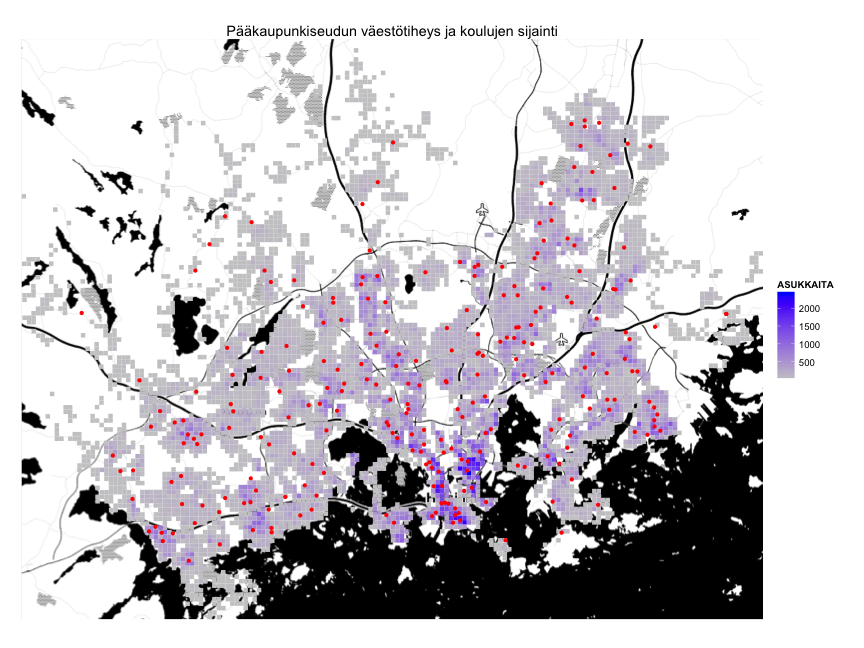

# helsinki - Pääkaupunkiseudun avoimen datan työkalupakki R-kielelle

### Miten koulujen sijainti pääkaupunkiseudulla suhtautuu asukastiheyteen?

Avoin data tarjoaa mahdollisuuden tutkia tämänkaltaisia kysymyksiä. Pääkaupunkiseudun kohdalla tämä onnistuu nyt [Datademo-rahoituksella](http://datademo.fi/) toteutetun [helsinki-kirjasto](https://github.com/rOpenGov/helsinki) avulla. Kirjasto tuo tärkeimmät pääkaupunkiseudun avoimen tietoaineistot R-laskentaympäristöön ja mahdollistaa niiden analyysin, yhdistämisen ja visualisoinnin.

Aloitetaan asentamalla helsinki-kirjasto:


```r
# Install and load package devtools first
install.packages("devtools")
library(devtools)
# Install development version of helsinki from github
install_github(repo = "helsinki", username = "ropengov")
# Install package helsinki from CRAN install.packages('helsinki') Load
# package
library(helsinki)
```


Tutkiaksemme koulujen sijainnin suhdetta väestötiheyteen haemme ensin vuoden 2013 väestöruudukon ([HSY:ltä](http://www.hsy.fi/seututieto/kaupunki/paikkatiedot/Sivut/Avoindata.aspx)) funktiolla `get_hsy()` ja muokataan data sopivaan muotoon.


```r
# Retrieve population grid for year 2013
popgrid.sp <- get_hsy(which.data = "Vaestotietoruudukko", which.year = 2013)
# Transform into lat/long coordinates
library(sp)
library(rgdal)
popgrid.sp <- sp::spTransform(popgrid.sp, CRS("+proj=longlat +datum=WGS84"))
# Transform to ggplot2-compatible data frame
library(ggplot2)
library(rgeos)
popgrid.df <- ggplot2::fortify(popgrid.sp, region = "INDEX")
# Merge original population grid data to the data frame
popgrid.df <- merge(popgrid.df, popgrid.sp, by.x = "id", by.y = "INDEX")
```


Haetaan sitten [Pääkaupunkiseudun Palvelukartan uudesta API:sta](http://api.hel.fi/servicemap/v1/) (uusi Palvelukartta [täällä](http://dev.hel.fi/servicemap/)) pääkaupunkiseudun peruskouluihin liittyvät palvelut funktiolla `get_servicemap()`.


```r
# Search services with 'perusopetus' (basic education)
res1 <- get_servicemap(query = "search", q = "perusopetus")
# List id, name and parent category id for the results
t(sapply(res1$results, function(x) c(x$id, x$name$fi, x$parent)))
```

```
##       [,1]    [,2]                                              [,3]   
##  [1,] "26444" "Perusopetus"                                     "26412"
##  [2,] "27638" "yleinen perusopetus"                             "27636"
##  [3,] "27668" "yleinen perusopetus"                             "27666"
##  [4,] "30351" "Luokkien 1-6 perusopetus"                        "30348"
##  [5,] "30429" "Luokkien 7-9 perusopetus"                        "30348"
##  [6,] "30518" "Erityispedagogiikan mukainen perusopetus"        "30348"
##  [7,] "30519" "steinerpedagogiikan mukainen perusopetus"        "30518"
##  [8,] "30526" "Ruotsinkielinen perusopetus 2013-2014"           "26444"
##  [9,] "30529" "Luokkien 1-6 perusopetus"                        "30526"
## [10,] "30559" "Luokkien 7-9 perusopetus"                        "30526"
## [11,] "32539" "Luokkien 1-6 perusopetus"                        "32536"
## [12,] "32617" "Luokkien 7-9 perusopetus"                        "32536"
## [13,] "32706" "Erityispedagogiikan mukainen perusopetus"        "32536"
## [14,] "32707" "steinerpedagogiikan mukainen perusopetus"        "32706"
## [15,] "32714" "Ruotsinkielinen perusopetus 2014-2015"           "26444"
## [16,] "32717" "Luokkien 1-6 perusopetus"                        "32714"
## [17,] "32747" "Luokkien 7-9 perusopetus"                        "32714"
## [18,] "30348" "Suomen- ja vieraskielinen perusopetus 2013-2014" "26444"
## [19,] "32536" "Suomen- ja vieraskielinen perusopetus 2014-2015" "26444"
```


Valitaan hakutuloksista numerot 4 ja 9 (id:t 30351 ja 30529), eli 'Luokkien 1-6 perusopetus' kategorioista 'Suomen- ja vieraskielinen perusopetus 2013-2014' ja 'Ruotsinkielinen perusopetus 2013-2014'.


```r
# Get all units under service ids 30351 and 30529 (use high 'page_size' to
# retrieve all results at once)
res2 <- get_servicemap(query = "unit", service = "30351,30529", page_size = 1000)
# Check which results have location information
has.location <- which(sapply(res2$results, function(x) !is.null(x$location)))
# Get coordinates for those results
coords <- t(sapply(res2$results[has.location], function(x) x$location$coordinates))
# Construct data frame
ed.df <- data.frame(long = coords[, 1], lat = coords[, 2], school = "alakoulu")
```


Datan visualisointia varten haetaan ensin karttatausta [Stamen-palvelusta](http://maps.stamen.com/) käyttäen [ggmap-kirjastoa](https://sites.google.com/site/davidkahle/ggmap). 


```r
# Get background map for helsinki using ggmap package
library(ggmap)
# Get bounding box from the population grid
hel.bbox <- as.vector(popgrid.sp@bbox)
# Get background map from Stamen maps
hel.map <- ggmap::get_map(location = hel.bbox, source = "stamen", maptype = "toner", 
    crop = TRUE)
```


Visualisoidaan lopuksi sekä väestöruudukko että koulujen sijainnit kartalle [ggplot2-kirjastolla](http://ggplot2.org/).


```r
# Plot background map
p <- ggmap(hel.map)
# Add population grid
p <- p + geom_polygon(data = popgrid.df, aes(x = long, y = lat, group = id, 
    fill = ASUKKAITA)) + scale_fill_gradient2(low = "white", high = "steelblue")
# Add services as points
p <- p + geom_point(data = ed.df, aes(x = long, y = lat, colour = school))
# Remove axis information
p <- p + theme(axis.title = element_blank(), axis.text = element_blank(), axis.ticks = element_blank())
# Add title
p <- p + ggtitle("Pääkaupunkiseudun väestötiheys ja koulujen sijainti")
# Print figure
print(p)
```

 


Kartalla näkyvät tiheästi asutut alueet sinisellä ja koulut punaisina pisteinä. Koulujen sijainti näyttää vastaavan hyvin väestökeskittymiä.

Helsinki-kirjaston kehitysversio löytyy [githubista](https://github.com/rOpenGov/helsinki) ja julkaisuversio [CRANista](http://cran.r-project.org/web/packages/helsinki/index.html). Kirjastossa mukana olevat datalähteet lyhyine esimerkkeineen löytyvät [tutoriaalista](https://github.com/rOpenGov/helsinki/blob/master/vignettes/helsinki_tutorial.md). Tärkeimmät mukana olevat datalähteet ovat tällä hetkellä
* [Helsingin kaupungin Kiinteistövirasto (HKK)](http://ptp.hel.fi/avoindata/)
* [Helsingin seudun ympäristöpalvelu (HSY)](http://www.hsy.fi/seututieto/kaupunki/paikkatiedot/Sivut/Avoindata.aspx)
* [Pääkaupunkiseudun Palvelukartan API](http://api.hel.fi/servicemap/v1/)
* [HRI:n tilasto-API](http://dev.hel.fi/stats/)


## Kohti kansainvälistä avoimen datan työkalujen verkostoa

Yhä useampien tietoaineistojen tullessa avoimeksi tarvitaan tehokkaita ja joustavia työkaluja datan esikäsittelyyn, analysointiin ja visualisointiin. [R-ohjelmointikieli](http://www.r-project.org/) on tutkimuskäytössä erittäin suosittu avoimen lähdekoodin tilastollinen ohjelmointikieli, jonka käyttö on kovassa kasvussa useilla aloilla. Olemme aiemmin luoneet suomalaisen avoimen datan tarpeisiin [sorvi R-kirjaston](http://louhos.github.io/sorvi/). Sorvin avulla tehtyjä esimerkkianalyysejä ja visualisointeja on julkaistu [Louhos-blogissa](http://louhos.wordpress.com/), jonka kävijämäärä ylitti juuri 30 000:n rajan.

Sorvi-kirjaston kehitystyö on tarjonnut erittäin hyödyllistä kokemusta ja näkemystä siitä miten avoimen lähdekoodin työkaluilla voidaan tukea avoimen datan hyödyntämistä mm. tutkimuksessa, opinnäytetöissä ja datajournalismissa. Samalla on käynyt selväksi että työkalut kannattaa jakaa useampaan kompaktiin kirjastoon, mikä helpottaa sekä kirjastojen käyttöä että ylläpitöä. Sorvista on helsinki-kirjaston lisäksi jo erotettu mm. [statfi](https://github.com/rOpenGov/statfi) ja [sotkanet](https://github.com/rOpenGov/sotkanet) -kirjastot. 

Sorvia kehittäessämme törmäsimme myös samankaltaisiin ulkomaisiin hankkeisiin, ja ajatus yhteistyöverkoston perustamisesta lähti liikkelle. Syksyllä 2013 pystytimme [rOpenGov-sivuston](http://ropengov.github.io/) sekä [github-organisaation](http://ropengov.github.io/) yhteistövetoiselle R-kirjastojen ekosysteemille. Mukana on jo paketteja mm. [Ruotsista](https://github.com/LCHansson/rSCB), [Venäjältä](http://markuskainu.fi/rustfare/index.html), [Puolasta](http://smarterpoland.pl/), [Itävallasta](https://github.com/skasberger/grazwahl2012) ja [USA:sta](https://github.com/rOpenGov/psData). 

rOpenGov-verkosto tarjoaa paitsi suuren määrän avoimia aineistoja R-kielelle, myös kiinnostavia mahdollisuuksia kansainväliseen tutkimustyöhön. Kun samoja aineistoja on tarjolla useista maista, saadaan analyyseihin kansainvälinen ulottuvuus. Esimerkiksi päätöksentekoon ja vaaleihin liittyviä aineistoja FIXME. 


